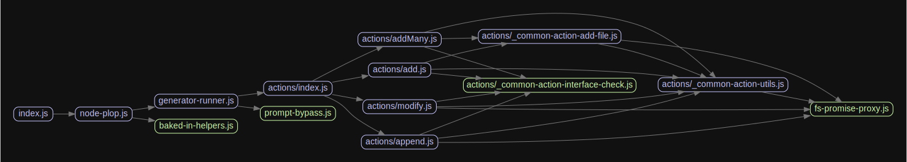

# 源码分析

## 文件结构

``` bash
/Users/liufang/openSource/FunnyLiu/node-plop
├── LICENSE
├── README.md
├── build-scripts
|  └── clean.js
├── package-lock.json
├── package.json
├── plop-templates
|  └── ava-test.js
├── plopfile.js
├── src
|  ├── actions
|  |  ├── _common-action-add-file.js
|  |  ├── _common-action-interface-check.js
|  |  ├── _common-action-utils.js
|  |  ├── add.js
|  |  ├── addMany.js
|  |  ├── append.js
|  |  ├── index.js
|  |  └── modify.js
|  ├── baked-in-helpers.js
|  ├── fs-promise-proxy.js
|  ├── generator-runner.js
|  ├── index.js
|  ├── node-plop.js
|  └── prompt-bypass.js
├── tests
|  ├── _base-ava-test.js
|  ├── abort-on-fail.ava.js
|  ├── action-data-cleanup.ava.js
|  ├── action-force-add.ava.js
|  ├── add-action-binary-file-mock
|  |  └── plop-logo.png
|  ├── add-action-binary-file.ava.js
|  ├── add-action-executable-file-mock
|  |  └── plop-templates
|  |     └── add.sh
|  ├── add-action-executable-file.ava.js
|  ├── add-action-failure.ava.js
|  ├── add-action-no-template.ava.js
|  ├── add-action-skip-function.ava.js
|  ├── add-action-transform-function.ava.js
|  ├── addMany-action-transform-function-mock
|  |  ├── file1.txt.hbs
|  |  └── file2.txt.hbs
|  ├── addMany-action-transform-function.ava.js
|  ├── addMany-dynamic-template-file-mock
|  |  ├── plop-templates
|  |  |  ├── bar-chart
|  |  |  |  ├── helpers
|  |  |  |  |  ├── not-included.txt
|  |  |  |  |  └── {{dashCase name}}.js
|  |  |  |  ├── {{dashCase name}}-bar-ctrl.js
|  |  |  |  └── {{dashCase name}}-bar-tmpl.html
|  |  |  └── line-chart
|  |  |     ├── {{dashCase name}}-line-ctrl.js
|  |  |     └── {{dashCase name}}-line-tmpl.html
|  |  └── plopfile.js
|  ├── addMany-dynamic-template-file.ava.js
|  ├── addMany-executable-file-mock
|  |  ├── plop-templates
|  |  |  └── {{dashCase executableName}}.sh
|  |  └── plopfile.js
|  ├── addMany-executable-file.ava.js
|  ├── addMany-multiple-files-mock
|  |  ├── plop-templates
|  |  |  ├── add.txt
|  |  |  ├── another-add.txt
|  |  |  ├── components
|  |  |  |  ├── logic
|  |  |  |  |  ├── {{dashCase name}}-ctrl.js
|  |  |  |  |  ├── {{dashCase name}}-plop-logo.png
|  |  |  |  |  ├── {{dashCase name}}-tmpl.html
|  |  |  |  |  └── {{dashCase name}}-view.js.hbs
|  |  |  |  └── tests
|  |  |  |     └── {{dashCase name}}.spec.js
|  |  |  └── nested-folder
|  |  |     ├── a-nested-add.txt
|  |  |     ├── another-nested-add.txt
|  |  |     └── my-name-is-{{dashCase name}}.txt
|  |  └── plopfile.js
|  ├── addMany-multiple-files.ava.js
|  ├── addMany-non-verbose-mock
|  |  ├── plop-templates
|  |  |  ├── add.txt
|  |  |  ├── another-add.txt
|  |  |  ├── components
|  |  |  |  ├── logic
|  |  |  |  |  ├── {{dashCase name}}-ctrl.js
|  |  |  |  |  ├── {{dashCase name}}-plop-logo.png
|  |  |  |  |  └── {{dashCase name}}-tmpl.html
|  |  |  |  └── tests
|  |  |  |     └── {{dashCase name}}.spec.js
|  |  |  └── nested-folder
|  |  |     ├── a-nested-add.txt
|  |  |     ├── another-nested-add.txt
|  |  |     └── my-name-is-{{dashCase name}}.txt
|  |  └── plopfile.js
|  ├── addMany-non-verbose.ava.js
|  ├── addMany-strip-extensions-mock
|  |  ├── plop-templates
|  |  |  ├── remove-all
|  |  |  |  ├── my-view.spec.js
|  |  |  |  └── my-view.spec.js.hbs
|  |  |  └── remove-hbs
|  |  |     ├── {{dashCase name}}-my-view.js.hbs
|  |  |     └── {{dashCase name}}-my-view.spec.js
|  |  └── plopfile.js
|  ├── addMany-strip-extensions.ava.js
|  ├── append-empty-mock
|  |  └── plopfile.js
|  ├── append-empty.ava.js
|  ├── append-mock
|  |  ├── package.json
|  |  ├── plop-templates
|  |  |  └── list.txt
|  |  └── plopfile.js
|  ├── append.ava.js
|  ├── basic-no-plopfile.ava.js
|  ├── basic-plopfile-mock
|  |  ├── package.json
|  |  ├── plop-templates
|  |  |  ├── add.txt
|  |  |  ├── change-me.txt
|  |  |  └── part.txt
|  |  └── plopfile.js
|  ├── basic-plopfile.ava.js
|  ├── custom-data-in-actions-mock
|  |  ├── plop-templates
|  |  |  └── who-loves-who.txt
|  |  └── plopfile.js
|  ├── custom-data-in-actions.ava.js
|  ├── dynamic-actions-mock
|  |  ├── plop-templates
|  |  |  ├── burger.txt
|  |  |  └── potatoes.txt
|  |  └── plopfile.js
|  ├── dynamic-actions.ava.js
|  ├── dynamic-prompts-mock
|  |  └── plopfile.js
|  ├── dynamic-prompts.ava.js
|  ├── dynamic-template-file-mock
|  |  ├── plop-templates
|  |  |  ├── bar-chart.txt
|  |  |  ├── change-me.txt
|  |  |  └── line-chart.txt
|  |  └── plopfile.js
|  ├── dynamic-template-file.ava.js
|  ├── force-del-outside-cwd-mock
|  |  └── sub
|  |     └── plopfile.js
|  ├── force-del-outside-cwd.ava.js
|  ├── generator-name-and-prompts.ava.js
|  ├── get-generator-list.ava.js
|  ├── imported-custom-action-mock
|  |  └── custom-action.js
|  ├── imported-custom-action.ava.js
|  ├── invalid-generator-names.ava.js
|  ├── lifecycle-hooks.ava.js
|  ├── load-assets-from-pack-mock
|  |  └── plopfile.js
|  ├── load-assets-from-pack.ava.js
|  ├── load-assets-from-plopfile-mock
|  |  └── plopfile.js
|  ├── load-assets-from-plopfile.ava.js
|  ├── load-nested-plopfile-generators-mock
|  |  ├── nested
|  |  |  ├── nested-plopfile.js
|  |  |  └── plop-templates
|  |  |     └── nested-test.txt
|  |  ├── plop-templates
|  |  |  └── test.txt
|  |  └── plopfile.js
|  ├── load-nested-plopfile-generators.ava.js
|  ├── missing-action-path.ava.js
|  ├── modify-action-transform-function.ava.js
|  ├── prompt-bypass-checkbox.ava.js
|  ├── prompt-bypass-confirm.ava.js
|  ├── prompt-bypass-list.ava.js
|  ├── prompt-bypass-mixed.ava.js
|  ├── prompt-bypass-validate.ava.js
|  └── set-generator-returns-generator.ava.js
├── tsconfig.json
└── types
   ├── index.d.ts
   ├── test.ts
   └── tsconfig.json

directory: 54 file: 132

ignored

```

## 外部模块依赖

请在： http://npm.broofa.com?q=node-plop 查看

## 内部模块依赖


  